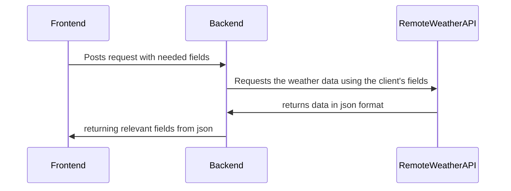

# IAF Golden-Route Project

### Weather Api Implementation UML

```mermaid
sequenceDiagram
    participant Frontend
    participant Backend
    participant RemoteWeatherAPI
    
    Frontend ->> Backend: Posts request with  needed fields
    Backend ->> RemoteWeatherAPI: Requests the weather data using the client's fields
    RemoteWeatherAPI ->> Backend: returns data in json format
    Backend ->> Frontend: returning relevant fields from json  

```