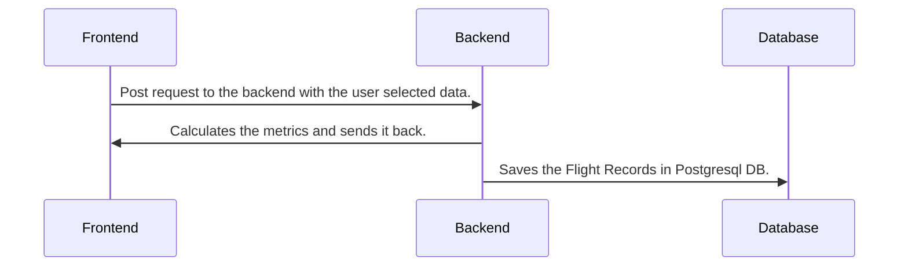
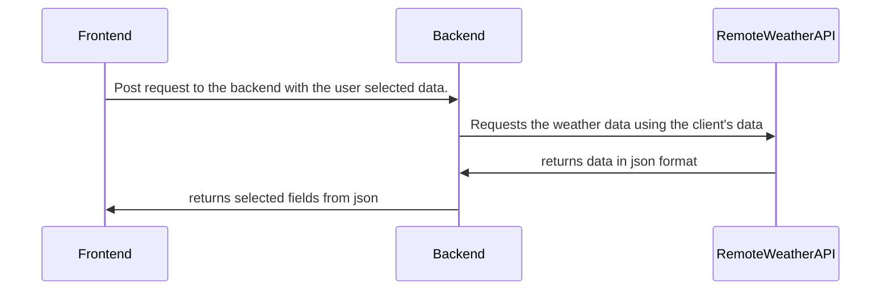
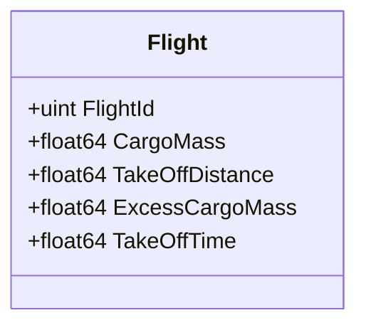

# IAF Golden-Route Project

## Task 1
### Calculations explanation
`m = base mass`
`M = cargo mass`

The acceleration is defined as follows:
$$a = \frac{F}{M_T} => \frac{F}{m+M}$$

We also know the formula:
$$t = \frac{V}{a}\ => \frac{V}{\frac{F}{m+M}} => \frac{V(m+M)}{F}$$

We can formulate the max cargo mass with the max take off time:
$$t_{max} = \frac{V(m+M_{max})}{F}$$
$$t_{max}\times F = V(m+M_{max})$$
$$\frac{t_{max}\times F}{V} = m+M_{max}$$
$$M_{max}=\frac{t_{max}\times F}{V}-m$$

<p>
The known max take off time is 60 seconds. We can calculate the exact Max Mass for the cargo based on that:
</p>

$$M_{max}=\frac{60\times100,000}{140}-35,000=7857.142857[kg]$$


It means that for every `M`, larger than the `M_max`, the take off time will exceed its limits. To find the excess mass we can subtract the current mass with the max cargo mass: 

$$M_{excess} = M_{current} - M_{max}$$

### Questions
<p>
    <b>Question 5: </b> We can use testing modules such as the "testing" package for golang or "JUnit" for java to run our functions against known input and check if the expected output is actually generated.<br>
    Some edge cases that might happen is mistyped input, or an invalid input value. We can regex the input we get from the frontend to validate its type (which I have done). We can also run value checks on the input to deteremine its validity, like checking that the CargoMass value is not negative. 
</p>
<p>
<b>Question 6: </b> We should calculate the wind resistence and direction, as it could change our take off distance.
 Moreover, we can implement complex mathmatical models that will enable us to calculate non constant accelaration, instead of constant one. Thus, making the calculator's conditions closer to reality.
</p>

## Task 4
<p>
<b>Question 4: </b> We might want to show the client if there's fog, which could cause blurry vision. 
</p>

## Task 5
### Calculator UML


### Weather Api Implementation UML


### Database tables
- Flight - saved in the database. 

`FlightId` is a sequence, auto incremented, assigned by the database. 


# Task 6
### Deployment
#### Step 1
Clone the project to your machine and cd into it: 
```bash
git clone "https://github.com/ido-nasi/Golden-Route-API.git"
cd Golden-Route-API
```

#### Step 2
Make sure you have the `docker-engine` and `docker-compose` installed<b>

Official installation guides:</b>
- docker engine: [https://docs.docker.com/engine/install/](https://docs.docker.com/engine/install)
- docker-compose: [https://docs.docker.com/compose/install/other/](https://docs.docker.com/compose/install/other/)

#### Step 3
After installing, from the root of the project, run:
```bash
docker-compose build
docker-compose up
```

The client will be running on `localhost:3000`

# Task 7
During war, the security of operational systems is at risk of <b>cyber attacks</b>. <br>
Here are a couple of protection ideas we can implement in this project to make it more secure:
- Encrypt traffic with ssl certificates.
- Provide basic defenses against common cyber attacks, such as ddos, sql injections, csrf etc.

## Possible Improvements:
- Implement defenses mentioned above.
- Generate flight statistics from database.
- Create personal login for each pilot, where he can view his recent flights statistics and learn from them.
