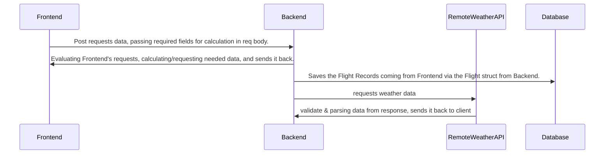

# IAF Golden-Route Project

## Task 1
<p>
    <b>Question 5: </b> We can use testing modules such as the "testing" package for golang or "JUnit" for java to run our functions against known input and check if the expected output is actually generated.<br>
    Some edge cases that might happen is mistyped input, or an invalid input value. We can regex the input we get from the frontend to validate its type (which I have done). We can also run value checks on the input to deteremine its validity, like checking that the CargoMass value is not negative. 
</p>
<p>
<b>Question 6: </b> We can calculate the wind resistence.
 Moreover, we can implement complex mathmatical models that will enable us to calculate non constant accelaration, instead of constant one. Thus, making the model's conditions closer to reality.
</p>

## Task 4
<p>
<b>Question 4: </b> We might want to show the client if there's fog, which could cause blurry vision. 
</p>

## Task 5
### Overview


### Weather Api Implementation UML


# Task 6
### Deployment
#### Step 1
Clone the project to your machine and cd into it: 
```bash
git clone "https://github.com/ido-nasi/Golden-Route-API.git"
cd Golden-Route-API
```

#### Step 2
Make sure you have the `docker-engine` and `docker-compose` installed<b>

Official installation guides:</b>
- docker engine: [https://docs.docker.com/engine/install/](https://docs.docker.com/engine/install)
- docker-compose: [https://docs.docker.com/compose/install/other/](https://docs.docker.com/compose/install/other/)

#### Step 3
After installing, from the root of the project, run:
```bash
docker-compose build
docker-compose up
```

The client will be running on `localhost:3000`